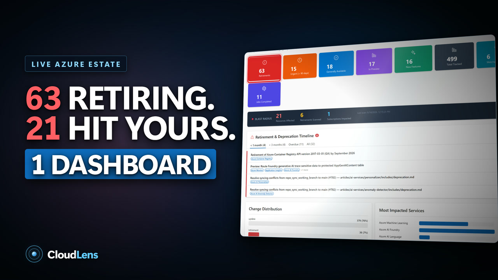

# CloudLens

> **Turn Azure change into informed action.**

CloudLens (the project formerly introduced as **AzRadar**) is an open-source Azure lifecycle and
service-health intelligence platform for platform engineering, cloud operations, and SRE teams.
It brings fragmented Azure signals into one operating view, uses AI to create a consistent
first-pass brief, maps relevant changes to deployed resources, and routes operational events to
the teams that need them.

[](https://dotnet.microsoft.com/)
[](https://react.dev/)
[](https://react.fluentui.dev/)
[](https://learn.microsoft.com/entra/identity/managed-identities-azure-resources/overview)
[](LICENSE)


## Watch the 99-second overview

<p align="center">
  <a href="https://www.youtube.com/watch?v=q13uVX0jBMs">
    
  </a>
</p>

<p align="center">
  <a href="https://www.youtube.com/watch?v=q13uVX0jBMs"><strong>▶ Watch on YouTube</strong></a>
</p>

## What it does

| Capability | Outcome |
|------------|---------|
| **Azure change radar** | Reconciles the Azure Updates catalog and RSS feed, retains revisions, and deduplicates announcements. |
| **Documentation intelligence** | Monitors Microsoft Learn and selected GitHub documentation for lifecycle-relevant changes. |
| **AI-assisted triage** | Produces a structured brief with change type, severity, affected services, deadlines, migration guidance, and effort. |
| **Lifecycle calendar** | Places dated retirements, deprecations, and planned changes into a single planning view. |
| **Blast-radius analysis** | Uses Azure Resource Graph to identify candidate deployed resources that may be affected. |
| **Scoped watchlists** | Filters intelligence by the Azure services and regions a team actually operates. |
| **Service Health operations** | Ingests Service Issues, Planned Maintenance, Health Advisories, and Security Advisories from registered subscriptions. |
| **Governed dispatch** | Delivers selected Service Health event families to CloudLens Teams channels and Azure DevOps Wiki targets with durable delivery evidence. |

CloudLens shortens the path from **“Microsoft announced something”** to **“we know what to
investigate.”** It supports engineering decisions; it does not autonomously certify impact or
perform remediation.

## How it works

```text
Azure Updates ─┐
Microsoft Learn ├──► Ingestion and deduplication ─► AI brief ─► Lifecycle calendar
GitHub changes ─┘                                      │
                                                      └──► Azure Resource Graph
                                                           candidate impact

Registered Azure subscriptions
        │
        ▼
Azure Service Health ─► Event Hubs ─► Cosmos DB ─► Service Bus
                                                       ├──► CloudLens in Teams
                                                       └──► Azure DevOps Wiki
```

The web application and background workers run as Linux containers on Azure App Service.
Cosmos DB Change Feed provides durable job dispatch, while Event Hubs and Service Bus separate
Service Health ingestion from downstream delivery.

## Security by design

- **Zero application keys:** Azure services authenticate with user-assigned managed identities.
- **Private data plane:** Cosmos DB, Azure OpenAI, Service Bus, Key Vault, and Azure Container
  Registry use private endpoints.
- **Private container supply chain:** App Services pull images from Premium ACR over VNet
  integration using scoped `AcrPull` assignments.
- **No registry credentials:** ACR admin access, anonymous pull, and public network access are
  disabled in the deployed state.
- **Deterministic routing:** AI enriches communication but does not decide whether an Azure
  Service Health event exists or which configured policy routes it.

## Architecture

| Component | Technology |
|-----------|------------|
| API and SPA host | .NET 8 Minimal API |
| Dashboard | React, TypeScript, Fluent UI v9 |
| Background processing | .NET 8 workers, Cosmos DB Change Feed |
| Operational event pipeline | Azure Event Hubs and Service Bus |
| Persistence | Azure Cosmos DB |
| AI analysis | Azure OpenAI |
| Estate correlation | Azure Resource Graph |
| Runtime hosting | Azure App Service for Linux containers |
| Container registry | Private Azure Container Registry |
| Authentication | User-assigned managed identity and Azure RBAC |
| Infrastructure | Modular Bicep |

The current deployment model is **one CloudLens deployment per customer tenant**. Coverage is
explicit: subscriptions, repositories, watchlists, Teams channels, and Wiki targets must be
registered or configured.

## Run locally

### Prerequisites

- .NET 8 SDK
- Node.js 20+
- Azure CLI authenticated to the required development resources

### Build and verify

```powershell
dotnet build AzRadar.slnx -p:Platform="Any CPU"
dotnet test tests\AzRadar.Shared.Tests

Set-Location src\az-radar-ui
npm ci
npx tsc --noEmit
```

### Start the dashboard

```powershell
Set-Location src\az-radar-ui
npm run dev
```

Application settings for Cosmos DB and Azure OpenAI are defined through the existing .NET
configuration model. Use Azure CLI or developer credentials locally; deployed services use
managed identity.

## Deploy to Azure

Infrastructure is defined under [`infra`](infra). The deployment provisions the VNet-integrated
App Services, private Azure services, managed identities, RBAC assignments, and private ACR.

```powershell
.\infra\deploy.ps1 `
  -ResourceGroup az-radar-vnet-rg `
  -Location centralus
```

For the staged private-registry image rollout:

```powershell
.\infra\deploy-private-acr.ps1
```

See [`infra/README.md`](infra/README.md) for prerequisites, parameters, image publication,
validation, and rollout details.

## Repository map

```text
src/
├── AzRadar.Api/                 REST API and React SPA host
├── AzRadar.JobHost/             Lifecycle intelligence workers
├── AzRadar.Shared/              Models, handlers, Azure clients, and shared services
├── Dispatching/                 Service Health ingestion and Teams/Wiki delivery
└── az-radar-ui/                 React + Fluent UI dashboard

infra/                           Bicep modules and deployment scripts
prds/                            Product requirements and as-built designs
presentation/                    Product presentation and promotional media
tests/                           Automated tests
```

New lifecycle sources use the `IJobHandler` extension point and are dispatched automatically by
job type after dependency-injection registration.

## Decision boundaries

- AI output is a structured starting point and should be checked against the source.
- Blast-radius results are candidate matches, not proof that every returned resource is affected.
- Service Health covers explicitly registered subscriptions and configured event families.
- CloudLens provides evidence, routing, and delivery status; ownership, acknowledgement, and
  remediation remain part of the organisation's operating process.

## License

[MIT](LICENSE)
