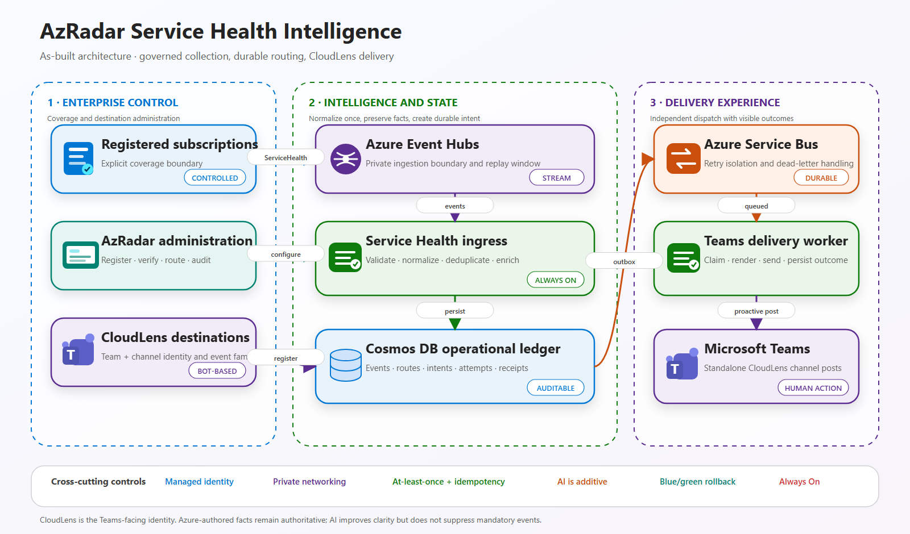
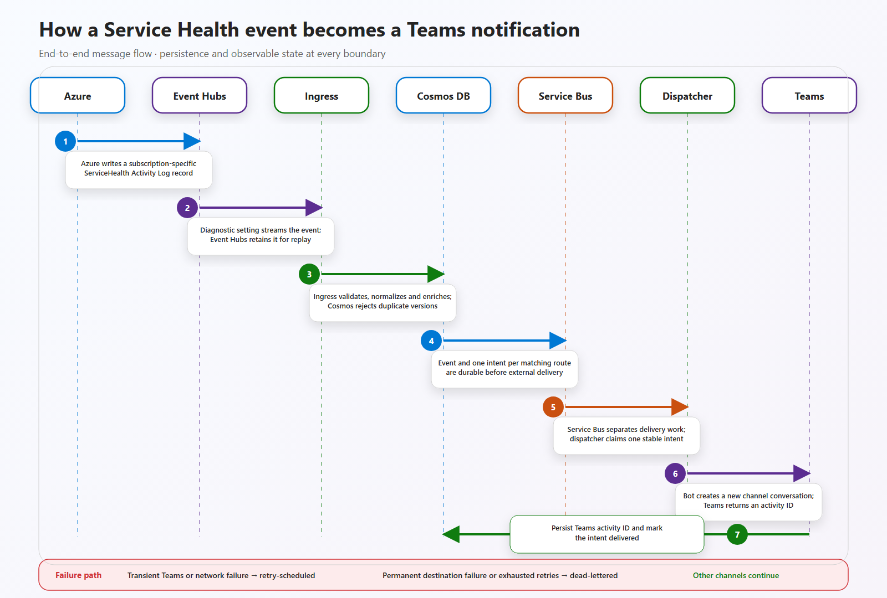

# AzRadar Service Health Intelligence and CloudLens Dispatch

> **Document type:** As-built solution design  
> **Audience:** Cloud architects, platform product owners, service management leaders, security and operations stakeholders  
> **Status:** Implemented  
> **Date:** 2026-09-11  
> **Related:** `prds/service-health-dispatch.md`

---

## 1. Executive summary

AzRadar extends Azure Service Health from a subscription-by-subscription portal experience into a
centrally governed enterprise capability. It allows a platform team to register selected Azure
subscriptions, collect their Service Health notifications through a private messaging path,
normalize and enrich those notifications, and distribute the relevant event families to
independently configured Microsoft Teams channels through the **CloudLens** Teams application.

The design addresses a common enterprise gap: Azure already knows which subscriptions are affected
by an incident, maintenance event, advisory, or security notification, but that information does
not automatically become a coordinated operational response. At scale, relying on each workload
team to create alert rules, maintain action groups, interpret messages, and preserve delivery
history creates inconsistent coverage and unclear accountability.

The implemented solution establishes a central control plane with four important properties:

1. **Centrally managed coverage.** AzRadar configures and verifies Service Health export only for
   subscriptions explicitly registered by an administrator.
2. **Durable event processing.** Azure Event Hubs separates Azure's event production from AzRadar
   processing, while Cosmos DB and Azure Service Bus provide durable state and delivery work.
3. **Controlled notification routing.** Each registered Teams channel independently selects the
   Service Health event families it should receive.
4. **Auditable delivery.** Events, routing decisions, delivery intents, attempts, outcomes, and
   failures remain visible even after a Teams message has been sent.

Azure OpenAI improves titles, summaries, and recommended actions, but it is not the authority for
whether a serious operational event exists. Azure-authored facts and deterministic routing remain
the foundation of the design.

---

## 2. Business context

### 2.1 The enterprise problem

Azure Service Health is personalized by subscription. That is useful for an individual
subscription owner, but a large enterprise normally operates Azure through shared platform,
security, service-management, and workload teams.

Without a central service, an enterprise must choose between two poor operating models:

- Ask every workload team to configure and maintain Service Health alert rules correctly.
- Expect a central operations team to inspect the Azure portal across a large subscription estate.

Both models create predictable risks:

- Incomplete subscription coverage.
- Different interpretations of what constitutes an incident or advisory.
- Duplicate notifications when one Azure incident affects many subscriptions.
- Important updates buried among low-value messages.
- Unmanaged webhook or workflow ownership.
- No reliable evidence that a notification was delivered.
- No durable enterprise history of the event and the response.

### 2.2 Product outcome

AzRadar turns Service Health into a managed product rather than a collection of local alerts. A
platform administrator can answer:

- Which subscriptions are currently covered?
- Which Azure event was received, and when?
- Was the event a Service Issue, Planned Maintenance, Health Advisory, or Security Advisory?
- Which Teams channels were eligible to receive it?
- Was delivery attempted, retried, completed, or dead-lettered?
- Was the event synthetic or generated by Azure?
- Can obsolete test or failed records be removed safely?

---

## 3. Scope of the implemented capability

### Included

- Explicit registration and removal of Azure subscriptions.
- Creation and verification of subscription-level diagnostic settings for the Activity Log
  `ServiceHealth` category.
- Central ingestion through Azure Event Hubs.
- Normalization, deduplication, persistence, and AI enrichment of Service Health events.
- Support for:
  - Service Issues
  - Planned Maintenance
  - Health Advisories
  - Security Advisories
- Registration of Teams channels through the tenant-managed CloudLens application.
- Per-channel selection of one or more supported event families.
- Durable delivery intents, retries, delivery attempts, and dead-letter handling.
- Standalone Teams channel posts for each notification.
- Synthetic event publication for controlled end-to-end validation.
- Administrative views for subscriptions, recent events, and delivery intents.
- Permanent deletion of terminal event and delivery records with protection for in-flight work.

### Not included

- Billing notifications, which are not part of the subscription Activity Log Service Health
  category.
- Automatic onboarding of every subscription in a tenant or management group.
- Workload-owner or CMDB-based routing.
- Automatic remediation of affected resources.
- ServiceNow, PagerDuty, email, or Azure DevOps work-item delivery.
- Legacy Teams Workflow URLs or Key Vault references for channel configuration.
- User-owned Power Automate or Logic App flows as a delivery dependency.

---

## 4. Design principles

### Central ownership, explicit scope

AzRadar does not silently enumerate or configure an entire enterprise estate. An administrator
registers each subscription, and the product reports whether the required permissions and
diagnostic setting are in place. This creates a controlled adoption path for regulated
environments and makes the boundary of coverage visible.

### Durable before convenient

An event is persisted before it is considered processed. A delivery is not considered successful
because a message was queued; it is successful only after Teams accepts it and the outcome is
stored. This distinction is essential for auditability and recovery.

### AI enriches; policy decides

The model can improve clarity and recommend action, but it cannot erase an Azure incident, reduce
the source severity, or bypass the configured routing policy. If AI is unavailable, the platform
retains enough source information to continue deterministic processing.

### Idempotency at every boundary

Azure messaging services provide at-least-once delivery. AzRadar therefore assumes duplicates will
occur and uses stable identifiers and content hashes to prevent duplicate event records and
duplicate external notifications.

### Channel configuration should express intent directly

A Teams destination is active when it is registered and has at least one selected event family.
There is no separate enabled/disabled switch that can contradict the selected routing policy.
Selecting no event families pauses notification delivery for that channel.

### Zero application secrets

Runtime access to Azure resources uses user-assigned managed identities. The design avoids API
keys, Cosmos connection keys, Service Bus connection strings, and user-owned workflow URLs.

---

## 5. As-built architecture

### 5.1 Architecture view



The architecture is intentionally divided into three operating domains:

- **Enterprise control** establishes subscription coverage and CloudLens destinations.
- **Intelligence and state** turns the Azure event stream into normalized, enriched, durable
  records.
- **Delivery experience** isolates Teams delivery and records the external outcome.

Editable source: [`service-health-as-built-architecture.excalidraw`](images/service-health-as-built-architecture.excalidraw)

Scalable vector: [`service-health-as-built-architecture.svg`](images/service-health-as-built-architecture.svg)

### 5.2 End-to-end message flow



The flow highlights two distinct durability points:

1. Event Hubs retains the original Azure event until the ingress worker can process it.
2. Cosmos DB and Service Bus retain delivery intent and work independently of Teams availability.

The return path from Teams to Cosmos DB is equally important: AzRadar marks a notification
delivered only after Teams returns an activity identifier and that outcome is persisted. Transient
failures move into retry handling; permanent failures or exhausted retries become visible
dead-letter records without blocking other channels.

Editable source: [`service-health-message-flow.excalidraw`](images/service-health-message-flow.excalidraw)

Scalable vector: [`service-health-message-flow.svg`](images/service-health-message-flow.svg)

### 5.3 Component responsibilities

| Component | Responsibility |
|---|---|
| AzRadar API and UI | Subscription registration, configuration verification, channel routing, synthetic tests, event inspection, and terminal-record cleanup. |
| Provisioning identity | Creates and verifies only the AzRadar-owned diagnostic setting on approved subscriptions. |
| Event Hubs | Receives the Azure Activity Log Service Health stream and provides a replay window during worker interruption. |
| Service Health ingress worker | Reads events continuously, normalizes the Azure payload, invokes enrichment, deduplicates, and creates delivery intents. |
| Cosmos DB | Stores subscription registrations, normalized events, Teams destinations, conversation references, intents, and delivery outcomes. |
| Service Bus | Separates event processing from external Teams delivery and supplies retry and dead-letter semantics. |
| Bot Gateway | Receives authenticated Teams activities and registers a stable Team/channel conversation reference. |
| Teams delivery worker | Renders the notification, creates a new channel conversation, records the Teams activity identifier, and classifies failures. |
| CloudLens Teams app | The tenant-managed user-facing notification identity installed in approved channels. |

---

## 6. Key operational flows

### 6.1 Registering a subscription

1. An administrator enters an Azure subscription ID in AzRadar.
2. AzRadar uses a dedicated provisioning managed identity to validate access.
3. It creates or updates a deterministic diagnostic setting that exports only the
   `ServiceHealth` Activity Log category to the central Event Hub.
4. It reads the configuration back and records the result as active, permission required, or
   configuration failed.
5. The UI displays the diagnostic-setting name, Event Hub destination, and actionable error
   information.

The normal **Unregister watching** action removes the subscription from AzRadar's active registry
without automatically deleting the Azure diagnostic setting. Removing that Azure-side setting is
a separate explicit operation, which avoids an administrative UI action unexpectedly changing the
subscription's monitoring configuration.

This approach deliberately avoids asking application teams to understand Azure Monitor diagnostic
settings or alert rules. It also avoids giving the central runtime identity broad rights to modify
subscriptions.

### 6.2 Ingesting an event

1. Azure emits a subscription-specific Service Health record.
2. The subscription diagnostic setting forwards it to Event Hubs.
3. The ingress worker normalizes the Azure envelope into a stable AzRadar event model.
4. A content-derived identifier prevents replayed or duplicate records from being stored twice.
5. Azure OpenAI creates a concise operational title, summary, severity interpretation, and
   recommended action.
6. AzRadar evaluates the event family against the registered Teams destinations.
7. The event is stored with either:
   - `ready-for-dispatch`, when one or more channels match; or
   - `no-route`, when no channel currently subscribes to that family.
8. One durable delivery intent is created for each matching destination.

The routing status describes whether a route existed. It is not a claim that external delivery has
already succeeded.

### 6.3 Registering and identifying a Teams channel

1. A Teams administrator installs CloudLens in an approved Team.
2. A user sends the registration message from the target channel.
3. The Bot Gateway captures the tenant, Team, channel, service URL, and conversation information.
4. It resolves friendly Team and channel names through the Teams platform APIs.
5. AzRadar displays `Team name / Channel name` plus a shortened stable channel identifier.
6. An administrator selects the event families that channel should receive.

The stable identifiers remain authoritative because names can change. Friendly names make the
configuration understandable to an operator without weakening identity or routing precision.

### 6.4 Delivering to Teams

1. The outbox worker finds pending delivery intents.
2. It publishes a stable envelope to Service Bus and marks the intent as queued.
3. The Teams delivery worker claims the intent using state-aware concurrency protection.
4. It validates that the Teams destination remains registered and has selected event families.
5. It restores the stored conversation and renders an Adaptive Card.
6. It creates a **new Teams channel conversation**, so the notification appears as an independent
   post rather than as a reply to the original registration message.
7. It records the Teams activity identifier and marks the intent delivered.

Transient failures are retried. Invalid or permanently unavailable destinations are dead-lettered
with an explicit reason. One failing channel does not invalidate the event or another channel's
successful delivery.

---

## 7. Routing model

The implemented routing model is intentionally simple and explainable:

```text
Registered Teams destination
AND event family selected for that destination
= one delivery intent
```

Each channel can select any combination of:

- Service Issues
- Planned Maintenance
- Health Advisories
- Security Advisories

Examples:

| Channel | Selected families | Intended audience |
|---|---|---|
| Cloud Operations / Incidents | Service Issues | Real-time incident response |
| Platform Maintenance | Planned Maintenance | Change and maintenance planning |
| Azure Governance | Health Advisories + Planned Maintenance | Medium-term platform action |
| Restricted Security Operations | Security Advisories | Controlled security distribution |

This model favors transparency over a complex rule language. It is sufficient for centrally
managed platform channels and can later be extended with service, region, subscription,
criticality, or ownership criteria.

---

## 8. Administrative experience

The Service Health Dispatch page is organized into three operational views:

### Register subscription

- Add and verify subscriptions.
- Send a selected type of synthetic Service Health event.
- Unregister watching.
- Review registered CloudLens destinations.
- Configure each channel's event-family selection.

### Recent ingested events

- Review normalized and enriched Service Health records.
- Distinguish synthetic events from Azure-originated events.
- See routing status, event family, service, region, tracking ID, and receipt time.
- Permanently delete an event when no active delivery is in flight.

### Pending delivery intents

- Inspect queued, retrying, failed, delivered, or dead-lettered notification work.
- Review failure codes and delivery context.
- Permanently remove terminal records.
- Protect active queued or dispatching work from accidental deletion.

The UI deliberately distinguishes **event routing status** from **delivery outcome**. An event can
be ready for dispatch while one destination succeeds and another dead-letters.

---

## 9. Security and compliance posture

### Identity separation

The design separates responsibilities across managed identities:

- Subscription provisioning identity for diagnostic-setting operations.
- Runtime identity for Event Hubs, Cosmos DB, Azure OpenAI, and related processing.
- Bot identity for authenticated Teams interactions.
- Dispatch identity for Service Bus and delivery-state access.

This allows permissions to be scoped by role and resource instead of concentrating all privileges
in one application identity.

### Network boundaries

- Event Hubs, Service Bus, Cosmos DB, and the core workers use private networking.
- The core AzRadar API remains protected according to the existing application posture.
- The Bot Gateway is the necessary public callback surface for Azure Bot Service.
- Bot requests must pass platform token validation; unrestricted anonymous business APIs are not
  introduced.
- Azure Monitor's trusted-service route into Event Hubs is an explicit platform integration
  exception, not general public network access.

### Data handling

- Teams conversation references are treated as restricted routing metadata.
- Tokens and unrestricted conversation payloads are not logged.
- Azure-authored facts remain distinguishable from AI-generated text.
- Security advisories can be routed only to explicitly selected destinations.
- Synthetic events are visibly marked to avoid confusion with production incidents.

---

## 10. Reliability and recoverability

### Why Event Hubs and Service Bus are both used

The two services solve different problems:

- **Event Hubs** is the ingestion stream. It absorbs Azure event bursts and retains events while
  an ingress worker is unavailable.
- **Service Bus** is the delivery work queue. It manages retries, message locks, dead-lettering,
  and isolation between external destinations.

Combining these responsibilities into one service would either weaken ingestion semantics or make
delivery control unnecessarily complex.

### Important reliability controls

- App Services hosting continuous listeners have **Always On** enabled.
- Cosmos persistence occurs before source progress is considered durable.
- Event and delivery identifiers are deterministic.
- Delivery intents have explicit state transitions.
- Teams messages are completed only after the external result is persisted.
- Permanent and transient failures are classified differently.
- Invalid message envelopes are dead-lettered instead of retried indefinitely.
- Blue/green image tags provide a quick application rollback path.

### Failure visibility

Failure is represented as data rather than hidden in logs. Operators can see:

- No matching route.
- Pending or queued delivery.
- Retry scheduling.
- Successful Teams activity ID.
- Permanent channel or conversation failure.
- Retry exhaustion and dead-letter reason.

This makes operational support possible without requiring direct access to every runtime component.

---

## 11. Architecture decisions and trade-offs

### Diagnostic settings instead of per-subscription alert rules

**Decision:** Export the subscription Activity Log `ServiceHealth` category to Event Hubs.

**Rationale:** Diagnostic settings provide a consistent central collection mechanism and remove
alert-rule expertise from workload teams.

**Trade-off:** A privileged administrator must grant the provisioning identity narrowly scoped
access on each registered subscription. Azure Monitor also requires a dedicated Event Hub
authorization-rule integration even though AzRadar itself remains keyless.

### Event streaming instead of portal or Resource Graph polling

**Decision:** Use Event Hubs as the primary source.

**Rationale:** Streaming preserves event timing and updates and decouples Azure production from
worker availability.

**Trade-off:** Event Hubs introduces checkpointing and operational monitoring. Resource Graph is
still valuable as a future reconciliation source, but not as the urgent notification path.

### Service Bus instead of direct Teams calls from ingestion

**Decision:** Persist delivery intent and dispatch asynchronously through Service Bus.

**Rationale:** Teams throttling or outage must not block event ingestion. Durable delivery work also
supports retries, dead-lettering, and independent channel failure.

**Trade-off:** The architecture has more components and eventual rather than immediate consistency.
For operational notifications, the reliability benefit outweighs the additional complexity.

### Tenant-managed Teams app instead of Teams Workflows

**Decision:** Use CloudLens through Azure Bot Service.

**Rationale:** Bot registration is centrally governed, supports durable destination identity,
avoids user-owned workflow lifecycle, and provides a path to message updates and richer
interactions.

**Trade-off:** A Bot Gateway must be publicly reachable by Azure Bot Service, and the Teams app
requires tenant administration and channel installation. This is a more formal onboarding process,
but it is more appropriate for an enterprise service.

### Event-family selection instead of a general-purpose rule engine

**Decision:** Let each channel select supported event families directly.

**Rationale:** The policy is easy to explain, operate, and audit. It addresses the immediate need
for distinct incident, maintenance, advisory, and security audiences.

**Trade-off:** It does not yet model subscription ownership, service domains, regional scope, or
business criticality. Those are extensions rather than hidden assumptions in v1.

### Standalone Teams posts instead of replies to registration

**Decision:** Create a new channel conversation for each notification.

**Rationale:** An operational event should be visible as a first-class channel post and should not
be buried beneath the historical message used to register CloudLens.

**Trade-off:** Each event consumes channel space. Future coalescing or update behavior may be
appropriate for high-frequency incident updates.

### Retaining AI while limiting its authority

**Decision:** Use AI for structured interpretation and communication, not for mandatory routing.

**Rationale:** Service Health messages benefit from clearer summaries and recommended actions, but
an LLM should not become a single point of failure or a safety-critical suppression mechanism.

**Trade-off:** Deterministic fallbacks may be less polished than AI output. They are nevertheless
predictable and operationally safe.

---

## 12. Current constraints

- Subscription onboarding remains explicit rather than automatic.
- Routing is central and event-family based; workload ownership is not yet resolved.
- Teams channel registration requires CloudLens installation and a registration message in each
  channel.
- Existing destinations registered before friendly-name resolution may need to register again to
  populate Team and channel names.
- Service Health Activity Log export does not cover billing notifications or events that Azure
  does not associate with a registered subscription.
- Private-channel behavior and sensitive advisory distribution require tenant-specific governance
  validation.
- The current design retains historical delivery failure data until an administrator removes
  terminal records.

---

## 13. Evolution path

The current architecture supports incremental expansion without replacing the ingestion or
delivery foundations.

### Near-term

- Resource Graph reconciliation for active events missing from the stream.
- More explicit delivery replay controls.
- Incident update and resolution handling against an existing Teams activity.
- Operational dashboards for consumer lag, delivery latency, and dead-letter rate.
- Restricted security-advisory presentation and access controls.

### Enterprise scale

- Management-group or policy-assisted subscription onboarding.
- CMDB, tag, or subscription-to-team ownership resolution.
- Service, region, subscription, and business-criticality routing dimensions.
- Low-urgency digests and maintenance lead-time policies.
- Additional delivery adapters such as ServiceNow or email.
- Multi-region recovery where justified by the enterprise service tier.

The durable event, intent, and delivery model is intentionally destination-neutral enough to
support these additions.

---

## 14. Product and architecture assessment

The implemented design makes a deliberate trade: it is more structured than a simple webhook, but
substantially more governable.

For a large enterprise, the important outcome is not merely that a card appears in Teams. The
important outcome is that subscription coverage is known, events are durable, routing is
explainable, delivery failures are visible, and no user's personal workflow becomes part of the
critical operational path.

AzRadar now provides that foundation. It converts Azure Service Health from a collection of portal
notifications into an enterprise-owned signal pipeline that can be operated, audited, and extended
as a cloud service-management capability.
